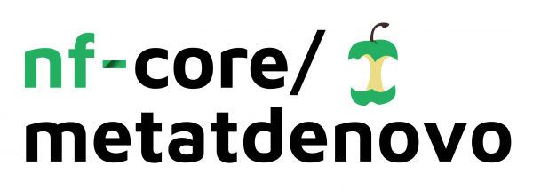

# 

**Assembly and annotation of prokaryotic metatranscriptomes.**.

[](https://github.com/nf-core/metatdenovo/actions)
[](https://github.com/nf-core/metatdenovo/actions)
[](https://www.nextflow.io/)

[](https://bioconda.github.io/)
[](https://hub.docker.com/r/nfcore/metatdenovo)
[](https://nfcore.slack.com/channels/metatdenovo)

## Introduction

**nf-core/metatdenovo** is a bioinformatics best-practise analysis pipeline for *de novo* assembly of primarily metatranscriptomes.
Besides assembling reads, it also calls ORFs and annotates them taxonomically and functionally.

The pipeline is built using [Nextflow](https://www.nextflow.io), a workflow tool to run tasks across multiple compute infrastructures in a very portable manner. It comes with docker containers making installation trivial and results highly reproducible.

## Quick Start

1. Install [`nextflow`](https://nf-co.re/usage/installation)

2. Install any of [`Docker`](https://docs.docker.com/engine/installation/), [`Singularity`](https://www.sylabs.io/guides/3.0/user-guide/) or [`Podman`](https://podman.io/) for full pipeline reproducibility _(please only use [`Conda`](https://conda.io/miniconda.html) as a last resort; see [docs](https://nf-co.re/usage/configuration#basic-configuration-profiles))_

3. Download the pipeline and test it on a minimal dataset with a single command:

    ```bash
    nextflow run nf-core/metatdenovo -profile test,<docker/singularity/podman/conda/institute>
    ```

    > Please check [nf-core/configs](https://github.com/nf-core/configs#documentation) to see if a custom config file to run nf-core pipelines already exists for your Institute. If so, you can simply use `-profile <institute>` in your command. This will enable either `docker` or `singularity` and set the appropriate execution settings for your local compute environment.

4. Start running your own analysis!

    ```bash
    nextflow run nf-core/metatdenovo -profile <docker/singularity/podman/conda/institute> --input '*_R{1,2}.fastq.gz' --emapper --megan_taxonomy --summary
    ```

See [usage docs](https://nf-co.re/metatdenovo/usage) for all of the available options when running the pipeline.

## Pipeline Summary

By default, the pipeline currently performs the following:

* Sequencing quality control (`FastQC`)
* Overall pipeline run summaries (`MultiQC`)
* Read trimming (`trim_galore`)
* Assembly (`Megahit`, `rnaSPAdes` or `Trinity`)
* ORF calling/annotation (`Prokka` or `trinotate`/`transdecoder`)
* Quantification of ORFs (`BBMap` and `subread`)

## Documentation

The nf-core/metatdenovo pipeline comes with documentation about the pipeline: [usage](https://nf-co.re/metatdenovo/usage) and [output](https://nf-co.re/metatdenovo/output).

Starting from Illumina sequence reads, the pipeline performs assembly -- using `Megahit`, `rnaSPAdes` or `Trinity` -- after trimming and, optionally, digital normalization of reads.
The assembly is followed by annotation by `Prokka` or ORF calling with `transdecoder` (the former (potentially) better suited for bacterial transcriptomes, the latter for eukaryotic).
ORFs can be annotated taxonomically by aligning them to the NCBI RefSeq database with `Diamond` and postprocessing with `Megan`.
This will produce an NCBI taxonomy as well as a GTDB taxonomy for Bacteria and Archaea.
The main functional annotation program in the pipeline is the `EggNOG mapper` (`--emapper`) but EggNOG and "Interpro2GO" annotations are also output as a side effect of the Diamond/Megan/RefSeq taxonomical annotation.

If you specify the `--summary` parameter, tab separated files, suitable for downstream analysis will be generated, by default in `results/summary`.

*Note:* Large databases are downloaded by default by the `--megan_taxonomy` and `--emapper` options.
The processed versions of these are saved in the output directory structure (by default `results/refseq/refseq_protein.dmnd`, `results/ncbi_taxonomy/ncbi_taxonomy.tsv.gz` and `results/eggnogdb` respectively) and can be used in the later runs of the pipeline by specifying the `--refseq_dmnd`, `--ncbitaxonomy` and `--eggnogdb` parameters with appropriate arguments (e.g. the paths given in this sentence).

## Credits

nf-core/metatdenovo was originally written by daniel.lundin@lnu.se and emelie.nilsson@lnu.se.

We thank the following people for their extensive assistance in the development
of this pipeline:

## Contributions and Support

If you would like to contribute to this pipeline, please see the [contributing guidelines](.github/CONTRIBUTING.md).

For further information or help, don't hesitate to get in touch on the [Slack `#metatdenovo` channel](https://nfcore.slack.com/channels/metatdenovo) (you can join with [this invite](https://nf-co.re/join/slack)).

## Citations

<!-- TODO nf-core: Add citation for pipeline after first release. Uncomment lines below and update Zenodo doi. -->
<!-- If you use  nf-core/metatdenovo for your analysis, please cite it using the following doi: [10.5281/zenodo.XXXXXX](https://doi.org/10.5281/zenodo.XXXXXX) -->

You can cite the `nf-core` publication as follows:

> **The nf-core framework for community-curated bioinformatics pipelines.**
>
> Philip Ewels, Alexander Peltzer, Sven Fillinger, Harshil Patel, Johannes Alneberg, Andreas Wilm, Maxime Ulysse Garcia, Paolo Di Tommaso & Sven Nahnsen.
>
> _Nat Biotechnol._ 2020 Feb 13. doi: [10.1038/s41587-020-0439-x](https://dx.doi.org/10.1038/s41587-020-0439-x).
> ReadCube: [Full Access Link](https://rdcu.be/b1GjZ)

In addition, references of tools and data used in this pipeline are as follows:

* [FastQC](https://www.bioinformatics.babraham.ac.uk/projects/fastqc/)

* [MultiQC](https://pubmed.ncbi.nlm.nih.gov/27312411/)
  
  > Ewels P, Magnusson M, Lundin S, Käller M. MultiQC: summarize analysis results for multiple tools and samples in a single report. Bioinformatics. 2016 Oct 1;32(19):3047-8. doi: 10.1093/bioinformatics/btw354. Epub 2016 Jun 16. PubMed PMID: 27312411; PubMed Central PMCID: PMC5039924.
 
* [Trim Galore!](https://www.bioinformatics.babraham.ac.uk/projects/trim_galore/)

* [Cutadapt](https://cutadapt.readthedocs.io/en/stable/)
  
  > Martin, Marcel. “Cutadapt Removes Adapter Sequences from High-Throughput Sequencing Reads.” EMBnet.Journal 17, no. 1 (May 2, 2011): 10–12. doi: 10.14806/ej.17.1.200.

* [BBTools](https://jgi.doe.gov/data-and-tools/bbtools/)

* [khmer](https://khmer.readthedocs.io/en/latest/)
  
  > Crusoe, Michael R., Hussien F. Alameldin, Sherine Awad, Elmar Boucher, Adam Caldwell, Reed Cartwright, Amanda Charbonneau, et al. “The Khmer Software Package: Enabling Efficient Nucleotide Sequence Analysis.” F1000Research 4 (September 25, 2015): 900. doi: 10.12688/f1000research.6924.1.
  >
  > Zhang, Qingpeng, Jason Pell, Rosangela Canino-Koning, Adina Chuang Howe, and C. Titus Brown. “These Are Not the K-Mers You Are Looking For: Efficient Online K-Mer Counting Using a Probabilistic Data Structure.” PLOS ONE 9, no. 7 (July 25, 2014): e101271. doi: 10.1371/journal.pone.0101271.

* [Megahit](https://github.com/voutcn/megahit)
  
  > Li, Dinghua, Chi-Man Liu, Ruibang Luo, Kunihiko Sadakane, and Tak-Wah Lam. “MEGAHIT: An Ultra-Fast Single-Node Solution for Large and Complex Metagenomics Assembly via Succinct de Bruijn Graph.” Bioinformatics, January 20, 2015, btv033. doi: 10.1093/bioinformatics/btv033.

* [rnaSPAdes](http://cab.spbu.ru/software/rnaspades/)
  > Bushmanova, Elena, Dmitry Antipov, Alla Lapidus, and Andrey D Prjibelski. “RnaSPAdes: A de Novo Transcriptome Assembler and Its Application to RNA-Seq Data.” GigaScience 8, no. giz100 (September 1, 2019). doi: 10.1093/gigascience/giz100.

* [Trinity](https://github.com/trinityrnaseq/trinityrnaseq/wiki)
  
  > Grabherr, Manfred G, Brian J Haas, Moran Yassour, Joshua Z Levin, Dawn A Thompson, Ido Amit, Xian Adiconis, et al. “Full-Length Transcriptome Assembly from RNA-Seq Data without a Reference Genome.” Nature Biotechnology, May 15, 2011. doi: 10.1038/nbt.1883.

* [Prokka](https://github.com/tseemann/prokka)
  
  > Seemann, Torsten. “Prokka: Rapid Prokaryotic Genome Annotation.” Bioinformatics, March 18, 2014, btu153. doi: 10.1093/bioinformatics/btu153.
  > 
  > Stajich, Jason E., David Block, Kris Boulez, Steven E. Brenner, Stephen A. Chervitz, Chris Dagdigian, Georg Fuellen, et al. “The Bioperl Toolkit: Perl Modules for the Life Sciences.” Genome Research 12, no. 10 (October 1, 2002): 1611–18. doi: 10.1101/gr.361602.
  > 
  > Tange, Ole. “GNU Parallel: The Command-Line Power Tool.” The USENIX Magazine, no. Feb 2011 (n.d.): 42–47.
  > 
  > Camacho, Christiam, George Coulouris, Vahram Avagyan, Ning Ma, Jason Papadopoulos, Kevin Bealer, and Thomas L. Madden. “BLAST+: Architecture and Applications.” BMC Bioinformatics 10, no. 1 (December 15, 2009): 421. doi: 10.1186/1471-2105-10-421.
  > 
  > Laslett, Dean, and Bjorn Canback. “ARAGORN, a Program to Detect TRNA Genes and TmRNA Genes in Nucleotide Sequences.” Nucleic Acids Research 32, no. 1 (January 1, 2004): 11–16. doi: 10.1093/nar/gkh152.
  > 
  > [Barrnap](https://github.com/tseemann/barrnap)
  > 
  > Eddy, Sean R. “Accelerated Profile HMM Searches.” PLoS Comput Biol 7, no. 10 (October 20, 2011): e1002195. doi: 10.1371/journal.pcbi.1002195.

* [TransDecoder](https://github.com/TransDecoder/TransDecoder/wiki)

* [EggNOG-mapper](https://github.com/eggnogdb/eggnog-mapper)
  >
  > Huerta-Cepas, Jaime, Kristoffer Forslund, Luis Pedro Coelho, Damian Szklarczyk, Lars Juhl Jensen, Christian von Mering, and Peer Bork. “Fast Genome-Wide Functional Annotation through Orthology Assignment by EggNOG-Mapper.” Molecular Biology and Evolution 34, no. 8 (August 1, 2017): 2115–22. doi: 10.1093/molbev/msx148.
  > 
  > Huerta-Cepas, Jaime, Damian Szklarczyk, Davide Heller, Ana Hernández-Plaza, Sofia K Forslund, Helen Cook, Daniel R Mende, et al. “EggNOG 5.0: A Hierarchical, Functionally and Phylogenetically Annotated Orthology Resource Based on 5090 Organisms and 2502 Viruses.” Nucleic Acids Research 47, no. D1 (January 8, 2019): D309–14. doi: 10.1093/nar/gky1085.

* [Diamond](https://github.com/bbuchfink/diamond)
  >
  > Buchfink, Benjamin, Chao Xie, and Daniel H Huson. “Fast and Sensitive Protein Alignment Using DIAMOND.” Nature Methods 12, no. 1 (January 2015): 59–60. doi: 10.1038/nmeth.3176.

* [MEGAN6](https://uni-tuebingen.de/fakultaeten/mathematisch-naturwissenschaftliche-fakultaet/fachbereiche/informatik/lehrstuehle/algorithms-in-bioinformatics/software/megan6/)
  >
  > Huson, Daniel H., Benjamin Albrecht, Caner Bağcı, Irina Bessarab, Anna Górska, Dino Jolic, and Rohan B. H. Williams. “MEGAN-LR: New Algorithms Allow Accurate Binning and Easy Interactive Exploration of Metagenomic Long Reads and Contigs.” Biology Direct 13, no. 1 (April 20, 2018): 6. doi: 10.1186/s13062-018-0208-7.
  > 
  > Huson, Daniel H., Alexander F. Auch, Ji Qi, and Stephan C. Schuster. “MEGAN Analysis of Metagenomic Data.” Genome Research 17, no. 3 (March 1, 2007): 377–86. doi: 10.1101/gr.5969107.
  > 
  > Huson, Daniel H., Sina Beier, Isabell Flade, Anna Górska, Mohamed El-Hadidi, Suparna Mitra, Hans-Joachim Ruscheweyh, and Rewati Tappu. “MEGAN Community Edition - Interactive Exploration and Analysis of Large-Scale Microbiome Sequencing Data.” PLOS Comput Biol 12, no. 6 (June 21, 2016): e1004957. doi: 10.1371/journal.pcbi.1004957.
  > 
  > Mitra, Suparna, Paul Rupek, Daniel C Richter, Tim Urich, Jack A Gilbert, Folker Meyer, Andreas Wilke, and Daniel H Huson. “Functional Analysis of Metagenomes and Metatranscriptomes Using SEED and KEGG.” BMC Bioinformatics 12 Suppl 1 (2011): S21. doi: 10.1186/1471-2105-12-S1-S21.

* [NCBI RefSeq](https://www.ncbi.nlm.nih.gov/refseq/)
  >
  > Haft, Daniel H, Michael DiCuccio, Azat Badretdin, Vyacheslav Brover, Vyacheslav Chetvernin, Kathleen O’Neill, Wenjun Li, et al. “RefSeq: An Update on Prokaryotic Genome Annotation and Curation.” Nucleic Acids Research 46, no. D1 (January 4, 2018): D851–60. doi: 10.1093/nar/gkx1068.
